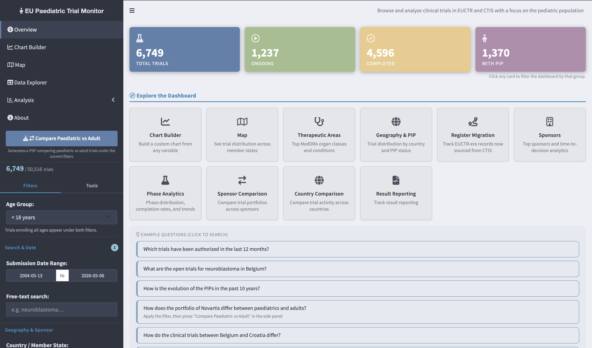

# EU Paediatric Trial Monitor

**v0.9.1** · R Shiny · EUCTR + CTIS · ~17 500 trials · **License:** MIT · **Authors:** Ruben Van Paemel, Levi Hoste

A research dashboard for exploring, analysing, and monitoring clinical trials registered in the European Union, with a focus on paediatric trials. The database covers all age groups so that paediatric and adult populations can be compared directly; the sidebar Age Group filter defaults to `< 18 years` to preserve the paediatric focus. Data is pulled from the EU Clinical Trials Register (EUCTR) and the Clinical Trials Information System (CTIS) using the [`ctrdata`](https://cran.r-project.org/package=ctrdata) package.



---

## Source data

Trial records are retrieved from two complementary EU registries using the `ctrdata` R package. Both queries fetch **all age groups** — paediatric and adult — so that the two populations can be compared directly in the dashboard.

| Register | URL | Query |
| -------- | --- | ----- |
| **EUCTR** — EU Clinical Trials Register | [clinicaltrialsregister.eu](https://www.clinicaltrialsregister.eu) | All trials (no age filter) |
| **CTIS** — Clinical Trials Information System | [euclinicaltrials.eu](https://euclinicaltrials.eu) | All trials (no age filter) |

### Search strings used

**EUCTR** — all trials, no age restriction:

```text
https://www.clinicaltrialsregister.eu/ctr-search/search?query=
```

**CTIS** — all trials:

```text
https://euclinicaltrials.eu/ctis-public/search#searchCriteria={}
```

These URLs are defined in `update_data.R` and passed to `ctrdata::ctrLoadQueryIntoDb()`. EUCTR is fetched in quarterly date-range chunks (2004 → present) with recursive bisection if a chunk exceeds 10 000 trials; completed chunks are logged to `data/done_chunks.txt` so interrupted runs resume from where they left off. `ctrdata` handles incremental updates internally — on repeat runs it only downloads records that are new or have changed. EUCTR results data (`euctrresults`) is **not** fetched by default (very slow); run `FORCE_RESULTS=true Rscript update_data.R` to load results and populate the `has_results` column used by the Results Posting tab.

---

## Example uses

The dashboard is designed for specific analytical workflows, not just browsing. Here are the scenarios it was built to support.

**Tracking a disease area over time**
Select a MedDRA organ class or specific condition, set a date range, and see how trial activity has changed year by year — including which sponsors are most active, whether the Phase I → Phase III pipeline is growing or stalling, and which EU member states participate most. The Chart Builder lets you cross any two dimensions without writing code.

**Results posting overview**
The Results Posting tab shows which completed trials have posted results to the registry and which have not. Results data is sourced directly from EUCTR (`endPoints.endPoint.readyForValues`) and CTIS (`resultsFirstReceived`) — not estimated. Charts break down by authorization year and sponsor type; the full list of completed trials without results is downloadable as CSV.

**Comparing sponsor portfolios**
Select 2–3 sponsors and the Sponsor Comparison tab renders side-by-side breakdowns of phase distribution, trial status, therapeutic areas, geographic reach, PIP involvement, and submission volume over time. Useful for competitive intelligence, partnership scoping, or regulatory submissions that require landscape context.

**Orphan / rare disease landscape**
The Orphan Designation filter (sourced from EUCTR DIMP D.2.5 and CTIS orphan designation numbers) narrows the dataset to orphan-designated products. Combined with MedDRA filtering, this surfaces the rare disease trial landscape for a given indication without manual registry searches.

**Pipeline maturity assessment**
The Completion Rate by Authorization Cohort chart (Phase Analytics) shows what percentage of trials authorized in each year have since completed, split by register. More recent cohorts naturally show lower rates; a plateauing line in an older cohort signals trials that have stalled rather than completed.

---

## Dashboard tabs

| Tab | What it shows |
| --- | ------------- |
| **Overview** | KPI cards, 5 most recent trials, submissions per year, register comparison |
| **Chart Builder** | Fully custom bar / line chart — any column on X, optional grouping, 4 chart types |
| **Map** | Open trials by country (circle map); sortable country table at zoom ≥ 5 |
| **Data Explorer** | Filterable/searchable table with CSV & Excel export, click-to-expand trial detail modal |
| **Basic Analytics** | Top organ classes, top MedDRA terms, country bar chart, PIP status, regulatory timeline |
| **Phase Analytics** | Phase by register / status / sponsor type, phase funnel, completion cohort |
| **Sponsor Comparison** | Side-by-side comparison of 2–3 selected sponsors across 6 dimensions |
| **Results Posting** | Results posted vs not posted for completed trials, by year and sponsor type; downloadable list |
| **About** | Data sources, feature descriptions, changelog, trial status definitions |

### Sidebar filters

All charts and tables update simultaneously when filters change. Active filters appear as chips above the content area with a one-click Reset all.

| Filter | Options |
| ------ | ------- |
| **Age Group** | `< 18 years` (default) / `≥ 18 years` / `All` — trials enrolling both age groups ("Paediatric & Adult") appear under both |
| Submission date range | Any date range from 2004 to today |
| Free-text search | Title, CT number, condition, product name, sponsor |
| Country / Member State | Multi-select; any EU or EEA country |
| Sponsor / Company | Multi-select; normalised names (legal suffixes stripped) |
| Trial Status | Ongoing / Completed / Other |
| Source Register | EUCTR / CTIS |
| Trial Phase | Phase I / II / III / IV |
| Part of PIP | Yes / No / Unknown |
| Orphan Designation | Yes / No / Unknown |
| MedDRA Organ Class | Multi-select |
| Condition / MedDRA Term | Multi-select with server-side search |

Filter state is encoded in the URL (`?f=` query param, base64 JSON) for bookmarking and sharing.

---

## How to deploy

### Requirements

- R ≥ 4.3
- A LaTeX distribution for PDF export (TinyTeX recommended: `tinytex::install_tinytex()`)

### Install R packages

```r
install.packages(c(
  "shiny", "shinydashboard", "shinycssloaders",
  "ctrdata", "nodbi", "RSQLite", "DBI",
  "dplyr", "tidyr", "stringr", "lubridate",
  "ggplot2", "plotly", "leaflet",
  "DT", "jsonlite", "base64enc",
  "readr", "writexl",
  "rmarkdown", "knitr", "kableExtra"
))
```

### Fetch data

```bash
Rscript update_data.R
```

This downloads all trial records from EUCTR and CTIS into `data/trials.sqlite`. First run takes several hours (EUCTR fetches ~44 000 trials in quarterly chunks; CTIS ~5 min). Subsequent runs are much faster — `ctrdata` only downloads records that are new or have changed. Completed chunks are logged to `data/done_chunks.txt`; delete this file to force a full re-fetch.

### Build the cache

```r
source("rebuild_cache.R")
```

Processes the SQLite database into `trials_cache.rds`. Run this after `update_data.R` or whenever the pipeline logic in `app.R` changes. The cache is automatically invalidated when the database file is newer.

### Run the app

```r
shiny::runApp()
```

Or from the terminal:

```bash
Rscript -e "shiny::runApp(port = 3838)"
```

### Docker

A `Dockerfile` and `docker-compose.yml` are included. The image starts the app on port 3838.

```bash
docker build -t paediatric-trials .
docker run -p 3838:3838 \
  -v $(pwd)/data:/shiny_trials/shiny_trials/data \
  -v $(pwd)/trials_cache.rds:/shiny_trials/shiny_trials/trials_cache.rds \
  paediatric-trials
```

With Docker Compose:

```bash
docker compose up -d
docker compose exec app Rscript /app/update_data.R  # first-time data load
```

The container expects `pdflatex` in `/usr/bin` for PDF report generation; the included image is based on `rocker/verse` which ships with TeX Live.

### Scheduled data updates

To refresh overnight, schedule `update_data.R` and `rebuild_cache.R` via cron (macOS/Linux):

```bash
0 3 * * * Rscript /path/to/update_data.R && Rscript /path/to/rebuild_cache.R >> /var/log/trials_rebuild.log 2>&1
```

After each rebuild the app loads the new RDS on the next session start (or immediately if `force_rebuild = TRUE` is passed to `load_trial_data()`).

---

## Known issues and pipeline limitations

**EUCTR first run is slow**
The initial fetch downloads ~44 000 trials across quarterly date-range chunks (2004 → present). Expect several hours. Progress is logged to `data/done_chunks.txt`; if the run is interrupted, re-running `update_data.R` will skip already-completed chunks automatically.

**CTIS country field**
CTIS stores member states as a nested JSON array. After flattening, some records return a string of numeric IDs or ISO codes rather than full country names. The `clean_member_state()` function resolves the majority, but edge cases (new member states, non-standard ISO entries) may appear as `NA` in the country column.

**MedDRA classification divergence between registers**
EUCTR stores MedDRA terms at the condition level; CTIS stores them at the trial level with additional codes. Trials appearing in both registers may show slightly different MedDRA assignments depending on which register version is kept after deduplication. The dashboard always prefers the CTIS record for trials present in both.

**Results and orphan fields require cache rebuild**
The `has_results` (results posted) and `is_orphan` (orphan designation) columns are derived from registry fields added in v0.7.0.

**Phase assignment for multi-phase trials**
EUCTR allows a trial to tick multiple phase flags simultaneously (e.g. Phase I + Phase II). The dashboard preserves these as `/`-separated values (`Phase I / Phase II`) rather than arbitrarily picking one. Charts that use `separate_rows()` handle this correctly; any external analysis of the exported CSV should account for multi-valued phase cells.

**Overlap detection accuracy**
Cross-register deduplication uses CT number matching first, then normalised title matching (first 80 characters, lowercased, punctuation stripped). Unusual title formatting or very short titles can result in missed matches (same trial counted twice) or false matches (different trials merged). The deduplication log is printed to console during cache rebuild.

**Cache invalidation**
The cache is invalidated only when the SQLite database file is newer than the RDS. If you edit `prepare_trial_data()` logic without touching the database, delete `trials_cache.rds` manually before restarting the app to force a rebuild.

---

## Changelog

### v0.9.1 — 2026-04-29

- **Preprocessing report**: added a standalone Age Group Coverage section for Paediatric / Adult / Paediatric & Adult / Unknown classifications, plus filter inclusion counts and register split.
- **Preprocessing audit fixes**: corrected the deduplication waterfall after the all-ages cache rename, restored EUCTR cache-base examples, and rendered the updated `www/preprocessing.html`.
- **Data pipeline**: `update_data.R` v16 now bisects EUCTR failures down to single-day ranges before trial-level fallback, and fallback URL reads use bounded retries/timeouts.
- **Docs and report paths**: updated remaining cache/database references to `trials.sqlite` and `trials_cache.rds`.

### v0.9.0 — 2026-04-29

- **All-ages dataset**: EUCTR and CTIS queries now fetch all age groups (not just paediatric). Database renamed from `pediatric_trials.sqlite` → `trials.sqlite`; cache renamed to `trials_cache.rds`. Total trials roughly doubled to ~17 500.
- **Age Group filter**: selectInput pinned at the top of the sidebar (`< 18 years` / `≥ 18 years` / `All`). Defaults to `< 18 years` to preserve existing behaviour. Trials enrolling both age groups appear under both filters. Wired into URL state, reset, active filter chips, and badge counter.
- **Chart Builder**: "Age Group" added as an X-axis and Group-by option (Paediatric / Adult / Both / Unknown).
- **Data pipeline — resilient ingestion engine** (`update_data.R` v15): quarterly date-range splitting with recursive bisection when a range exceeds the 10 000-trial EUCTR limit. Completed and failed chunks logged to `data/done_chunks.txt` / `data/failed_chunks.txt` so interrupted runs resume from where they left off.

### v0.8.2 — 2026-04-28

- **Pipeline audit report**: `preprocessing.Rmd` added — knits to `www/preprocessing.html` (linked from the About tab). Documents every normalisation step, deduplication counts with real intermediate row totals, before/after examples, and a severity-ranked data quality issue list with `app.R` fix suggestions.
- **Data pipeline**: transitioned EUCTR trials now matched to CTIS counterparts by base ID (strip country/version suffix) as a fallback after title_key matching — catches cases where the trial title changed during the EUCTR→CTIS transition.

### v0.8.1 — 2026-04-28

- **Map — per million children**: radio button in the map box toggles between total trial counts and trials per million children (0–17). Population data from Eurostat 2023 (EU/EEA) and UN WPP 2022 (all other countries); covers all 108 countries in the map. Countries with no population data (Liechtenstein) shown in grey with a note.
- **Chart Builder — normalise by child population**: a "Normalise by child population" checkbox appears below the controls when the x-axis or group is set to "Country / Member State". Divides each country's count by its own child population. Column header in the summary table updates to "Trials / M children".

### v0.8.0 — 2026-04-27

- **Recent trials table**: sorted by authorization date (was submission date); rows clickable — opens the same trial detail modal as the Data Explorer.
- **"Register Comparison" renamed** to "Trial Status by Register".
- **Mononational filter**: toggle button in Geography & Sponsor sidebar section below the Country filter; state encoded in URL; shows active badge and filter chip.
- **Clickable KPI value boxes**: clicking Ongoing/Completed filters trial status; clicking Total resets; clicking PIP sets PIP filter to Yes.
- **Results Posting tab**: new "Completed Trials With Results Posted" table with download button, above the existing overdue list.
- **Sponsor Comparison**: note added explaining that percentages are calculated within each sponsor's own portfolio.
- **Days to decision — data quality**: negative values (decision before submission, impossible in practice) now set to NA during cache build rather than silently dropped chart-by-chart. Requires cache rebuild.
- **Days to Decision by Sponsor Type**: changed from overlapping violin plot to grouped box plot (EUCTR / CTIS side-by-side per sponsor type).
- **Trial Phase by Sponsor Type**: changed from grouped to stacked bar chart, consistent with the other phase charts.
- **Phase Analytics — two new completion rate charts**: Completion Rate by Sponsor Type (line chart, Academic vs Industry) and Completion Rate by Phase (bar chart, Phase I–IV).

### v0.7.1 — 2026-04-20

- **Nord Light theme**: palette and CSS added to codebase (hidden from theme selector while in development).
- **PDF report**: switched LaTeX engine from pdflatex to xelatex to fix Unicode crash (`≥` and other characters from trial data breaking PDF generation); Helvetica font set via `fontspec` with automatic fallback to TeX Gyre Heros on Linux.
- **Violin plots (log scale)**: Time from Submission to Decision and Days to Decision by Sponsor Type now use a log₁₀ y-axis; data is pre-transformed before kernel density estimation so violin shapes are correct.

### v0.7.0 — 2026-04-19

- **Results Posting tab**: shows which completed trials have posted results to the registry and which have not, using real registry data (`endPoints.endPoint.readyForValues` for EUCTR; `resultsFirstReceived` for CTIS). Value boxes (completed total, results posted %, academic/industry without results), bar chart by authorization year, breakdown by sponsor type, downloadable CSV.
- **Orphan Designation filter**: derived from EUCTR DIMP D.2.5 field and CTIS orphan designation numbers; fully integrated with URL state, reset, and active filter chips.

### v0.6.1 — 2026-04-19

- Data pipeline: trials with NA status now classified as Other instead of being silently excluded.
- Additional cross-register deduplication: EUCTR records with a matching CT number or normalised title in CTIS are dropped in favour of the CTIS copy.
- Pre-2023 CTIS records (migrated from EudraCT) relabelled as EUCTR so the Submissions per Year chart shows CTIS bars only from 2023 onward.
- Sidebar trial count bar showing filtered / total trials.
- Basic Analytics: Top MedDRA Organ Classes and Top Conditions charts expanded to full width.

### v0.6.0 — 2026-04-18

- Sidebar filters and tools split into Filters / Tools tabs to reduce scrolling.
- Filters reordered: date range and free-text at top, then sponsor and country.
- Trial Status and Source Register converted from checkboxes to selectize dropdowns.
- Active filter chips redesigned as two-tone pills.
- Tools tab: compact full-width Save / Load / PDF / Theme buttons.

### v0.5.1 — 2026-04-18

- Sponsor Comparison promoted to a dedicated sidebar tab with contextual help.
- PIP Unknown category displayed in amber.
- Removed Cumulative Trials by Start Date from Overview.

### v0.5.0 — 2026-04-18

- Free-text search now includes sponsor name.
- Phase Funnel chart (Phase Analytics).
- Completion Rate by Authorization Cohort line chart.
- Sponsor Comparison section in Analytics (when 2–3 sponsors selected).

### v0.4.0 — 2026-04-15

- Trial detail modal (click any row in Data Explorer).
- URL state: filters encoded in `?f=` query string.
- Active filter chips with Reset all.
- Violin plot for days-to-decision by sponsor type.
- Empty-state messages on charts; plotly toolbar with PNG export.

### v0.3.0 — 2026-04-06

- Chart Builder tab: custom bar/line charts with freely chosen X axis, grouping, and four chart types; included in PDF report.

### v0.2.4 — 2026-04-05

- Sponsor name normalisation (legal suffix stripping, canonical brand mapping, ~28% reduction in duplicate names).
- Sponsor filter, Top Sponsors bar chart, Sponsor Trial Timeline.
- Seven normalisation logs written to `data/` on each cache rebuild.

### v0.2.3 — 2026-03-30

- Data Explorer: Decision Date column added.
- Basic Analytics: violin plot of days from submission to decision, split by register.

### v0.2.2 — 2026-03-30

- Data pipeline: EUCTR download skipped when query URL unchanged since last run; nightly updates re-fetch only CTIS (~5 min) unless search criteria change.

### v0.2.1 — 2026-03-29

- MedDRA spelling normalisation (leukemia → leukaemia, tumor → tumour, etc.) and Roman numeral type notation converted to Arabic (Type I → Type 1).

### v0.2.0 — 2026-03-29

- Filter save/restore: download active filter settings as JSON; re-upload to restore in any session.
- PDF report: full summary PDF for any filter selection via sidebar.

### v0.1.5 — 2026-03-29

- Analytics split into Analytics and Phase Analysis tabs.

### v0.1.4 — 2026-03-28

- Sidebar: Trial Phase filter added.
- Analytics: Phase charts by register, status, and sponsor type.

### v0.1.3 — 2026-03-28

- Map tab: interactive Leaflet map of ongoing trials by country; trial table at zoom ≥ 5.

### v0.1.1 — 2026-03-28

- Overview: Sponsor Type by Register chart; CT numbers as clickable links.
- Analytics: PIP Status by Year chart; MedDRA SOC code resolution.

### v0.1.0

Initial release.

---

## Project structure

```text
.
├── app.R                        # Main Shiny application
├── update_data.R                # Fetches data from EUCTR and CTIS into SQLite
├── rebuild_cache.R              # Rebuilds RDS cache from SQLite (no re-download)
├── report.Rmd                   # PDF report template (rendered on demand)
├── trials_cache.rds             # Processed data cache (git-ignored)
├── Dockerfile
├── docker-compose.yml
├── data/
│   ├── trials.sqlite                    # Raw trial data from ctrdata (git-ignored)
│   ├── sponsor_normalisation_log.csv
│   ├── country_normalisation_log.csv
│   ├── meddra_term_normalisation_log.csv
│   ├── organ_class_normalisation_log.csv
│   ├── phase_normalisation_log.csv
│   ├── status_category_normalisation_log.csv
│   ├── status_display_normalisation_log.csv
│   └── deploy/                          # Docker deployment files
└── www/
    └── favicon.svg
```

---

## Configuration

| Variable | Default | Description |
| -------- | ------- | ----------- |
| `DB_PATH` | `./data/trials.sqlite` | SQLite database file |
| `DB_COLLECTION` | `trials` | Collection name within the database |
| `CACHE_PATH` | `trials_cache.rds` | Processed data cache (app root) |

---

## Technology stack

| Layer | Package(s) | Role |
| ----- | ---------- | ---- |
| Data retrieval | [`ctrdata`](https://github.com/rfhb/ctrdata) | Unified access to EUCTR and CTIS |
| Database | [`nodbi`](https://github.com/ropensci/nodbi) + [`RSQLite`](https://cran.r-project.org/package=RSQLite) | Local document store over SQLite |
| Web framework | [`shiny`](https://shiny.posit.co/) + [`shinydashboard`](https://rstudio.github.io/shinydashboard/) | Dashboard UI |
| Charts | [`plotly`](https://plotly.com/r/) + [`ggplot2`](https://ggplot2.tidyverse.org/) | Interactive + PDF visualisations |
| Map | [`leaflet`](https://rstudio.github.io/leaflet/) | Country-level interactive map |
| Tables | [`DT`](https://rstudio.github.io/DT/) | Interactive data tables |
| Data wrangling | [`dplyr`](https://dplyr.tidyverse.org/), [`tidyr`](https://tidyr.tidyverse.org/), [`stringr`](https://stringr.tidyverse.org/), [`lubridate`](https://lubridate.tidyverse.org/) | Data manipulation |
| Export | [`writexl`](https://cran.r-project.org/package=writexl), [`readr`](https://readr.tidyverse.org/) | CSV and Excel download |
| URL state | [`base64enc`](https://cran.r-project.org/package=base64enc), [`jsonlite`](https://cran.r-project.org/package=jsonlite) | Filter serialisation to URL |
| Report | [`rmarkdown`](https://rmarkdown.rstudio.com/) | PDF report generation |

---

## Acknowledgements

Trial data is retrieved from two official EU registries:

- **EUCTR** — [EU Clinical Trials Register](https://www.clinicaltrialsregister.eu), European Medicines Agency. Covers trials submitted from 2004 under Directive 2001/20/EC.
- **CTIS** — [Clinical Trials Information System](https://euclinicaltrials.eu), European Medicines Agency. Mandatory for new applications from January 2023 under Regulation (EU) No 536/2014.

Data retrieval is powered by the [`ctrdata`](https://cran.r-project.org/package=ctrdata) R package (Ralf Herold), which provides a unified interface for querying, downloading, and storing trial records from multiple EU and international registries.

MedDRA terminology is the property of the International Council for Harmonisation of Technical Requirements for Pharmaceuticals for Human Use (ICH). Use of MedDRA terminology requires a licence; this dashboard uses MedDRA codes and terms as provided by the registries under their public data policies.

Built with [R Shiny](https://shiny.posit.co), [shinydashboard](https://rstudio.github.io/shinydashboard/), [plotly](https://plotly.com/r/), [leaflet](https://rstudio.github.io/leaflet/), and [DT](https://rstudio.github.io/DT/).
