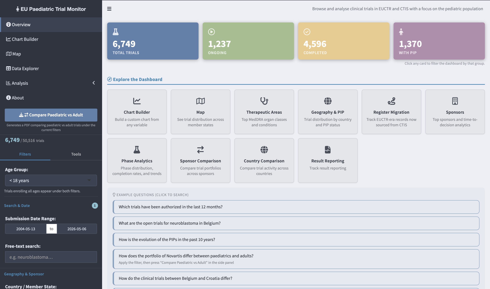

# EU Paediatric Trial Monitor

**v0.12.1** | R Shiny | EUCTR + CTIS | 16,209 deduplicated trials in the current local cache | MIT

Authors: Ruben Van Paemel and Levi Hoste

EU Paediatric Trial Monitor is an R Shiny dashboard for exploring clinical trials registered in the European Union, with a practical focus on paediatric development. The database intentionally covers all age groups so paediatric and adult trial landscapes can be compared directly. The app defaults the Age Group filter to `< 18 years`, but adult and all-age views are available from the same dataset.

The app combines records from the EU Clinical Trials Register (EUCTR) and the Clinical Trials Information System (CTIS), normalises key fields at cache-build time, and exposes the result through interactive charts, maps, tables, comparison views, and downloadable reports.



## What It Supports

- Track trial activity by year, country, sponsor, phase, status, therapeutic area, MedDRA term, active substance, PIP status, orphan designation, and result-reporting status.
- Compare paediatric and adult trial landscapes under the same filters.
- Compare 2-3 countries or 2-3 sponsors side by side.
- Identify completed trials with and without registry results.
- Explore PIP decision and waiver evidence using EMA decision data.
- Browse and export filtered trial-level records with expanded trial detail.
- Audit data preprocessing through the generated preprocessing report in the app's About tab.


## Source Data

Data is retrieved with [`ctrdata`](https://cran.r-project.org/package=ctrdata) from two official EMA registries:

| Register | Source | Query |
| --- | --- | --- |
| EUCTR | [clinicaltrialsregister.eu](https://www.clinicaltrialsregister.eu) | All trials, no age filter |
| CTIS | [euclinicaltrials.eu](https://euclinicaltrials.eu) | All trials, no age filter |

The default update refreshes CTIS only. EUCTR is opt-in because the historical EUCTR load is large and changes slowly. Explicit EUCTR refreshes run in quarterly chunks from 2004 to the present, resume from `data/done_chunks.txt`, and write failed ranges or trial IDs to `data/failed_chunks.txt`.

EUCTR result documents are not fetched by default because they add significant runtime. Use `--euctr-results` only when the full EUCTR result-document refresh is needed.

## Dashboard Areas

| Area | Purpose |
| --- | --- |
| Overview | KPI cards, recent trials, example questions, and shortcuts into the main workflows |
| Chart Builder | Custom bar, line, grouped bar, and stacked charts from shared app dimensions |
| Map | Filtered country distribution with age-aware per-million normalisation |
| Data Explorer | Searchable, filterable trial table with CSV/Excel export and trial-detail modal |
| General Statistics | Yearly volume, completion by cohort/sponsor type, participant-count distribution, and trial duration |
| Active Substances | Top normalised substances and yearly evolution |
| Therapeutic Areas | MedDRA organ class and condition views |
| Geography | Country-level trial distribution under active filters |
| PIP Analysis | PIP identifiers, EMA decision matches, waiver/deferral evidence, and ambiguity flags |
| Phase Analytics | Phase distribution, status, sponsor type, and completion by phase |
| Result Reporting | Completed trials with and without registry results |
| Country Comparison | Side-by-side country comparison across phase, status, sponsor type, PIP/orphan status, trial scale, substances, time, and results |
| Sponsor Comparison | Side-by-side sponsor comparison across phase, status, geography, PIP/orphan status, trial scale, substances, time, and results |
| About | Data sources, audit report, definitions, and changelog |

## Filters

Most charts and tables respond to the same sidebar filters:

- Age Group: `< 18 years` by default, `>= 18 years`, or `All`.
- Submission date range.
- Free-text search across title, trial identifier, condition, product, and sponsor fields.
- Country / Member State.
- Sponsor / Company.
- Trial status.
- Source register.
- Trial phase.
- PIP involvement and PIP waiver status.
- Orphan designation.
- MedDRA organ class and condition term.
- Product / substance, backed by pre-computed substance labels.

Filter state is encoded in the URL as a base64 JSON `?f=` query parameter, so filtered views can be bookmarked and shared.

## How The Data Pipeline Works

The app is designed so expensive data cleaning happens before Shiny sessions start.

```text
update_data.R
  -> data/trials.sqlite

rebuild_cache.R
  -> app.R data preparation
  -> trials_cache.rds
  -> sponsor normalisation pipeline
  -> substance normalisation pipeline
  -> PIP helper columns
  -> www/preprocessing.html

app.R startup
  -> load trials_cache.rds
  -> join data/trial_sponsor_labels.csv
  -> join data/trial_substance_labels.csv
  -> serve Shiny UI
```

Important generated files:

| File | Purpose |
| --- | --- |
| `data/trials.sqlite` | Local SQLite document store populated by `ctrdata` |
| `trials_cache.rds` | Processed app cache |
| `data/trial_sponsor_labels.csv` | App-facing normalised sponsor labels |
| `data/trial_substance_labels.csv` | App-facing normalised substance labels |
| `data/*_normalisation_log.csv` | Audit inputs for the preprocessing report |
| `www/preprocessing.html` | Rendered preprocessing audit shown in the About tab |

Most generated data artifacts are ignored by Git.

## Quick Start

### Requirements

- R 4.3 or newer.
- A working browser available to `ctrdata` for CTIS retrieval.
- Pandoc for rendering the preprocessing report.
- A LaTeX distribution with `xelatex` for PDF reports. TinyTeX is fine:

```r
tinytex::install_tinytex()
```

### Install R packages

This project does not currently use `renv`, so packages are installed from CRAN.

```r
install.packages(c(
  "shiny", "shinydashboard", "fresh", "shinycssloaders", "htmltools",
  "ctrdata", "nodbi", "RSQLite", "DBI", "jqr",
  "dplyr", "tidyr", "purrr", "tibble",
  "stringr", "stringi", "stringdist", "lubridate", "forcats",
  "ggplot2", "plotly", "leaflet", "scales", "eulerr",
  "DT", "jsonlite", "base64enc",
  "readr", "readxl", "writexl",
  "httr2", "rvest", "xml2",
  "rmarkdown", "knitr", "kableExtra"
))
```

### Run from existing local data

If `trials_cache.rds` is already present:

```r
shiny::runApp()
```

Or from a shell:

```bash
Rscript -e "shiny::runApp(port = 3838)"
```

The app loads the cache first. If the cache is missing, stale, or incompatible with the current `DATA_PROCESSING_VERSION`, it rebuilds from `data/trials.sqlite`.

### Refresh CTIS and rebuild

```bash
Rscript update_data.R
Rscript rebuild_cache.R
```

`rebuild_cache.R` rebuilds the RDS cache, regenerates sponsor and substance labels, refreshes PIP helper columns, and attempts to render `www/preprocessing.html`.

### Refresh EUCTR too

```bash
Rscript update_data.R --euctr
Rscript rebuild_cache.R
```

Equivalent environment-variable form:

```bash
REFRESH_EUCTR=true Rscript update_data.R
Rscript rebuild_cache.R
```

### Refresh EUCTR result documents

```bash
Rscript update_data.R --euctr-results
Rscript rebuild_cache.R
```

This automatically enables the EUCTR path and can be much slower than the normal metadata refresh.

## Common Maintenance Workflows

### Refresh EMA PIP Decisions

```bash
Rscript helper_scripts/update_pip_decisions.R
Rscript rebuild_cache.R
```

The script downloads EMA's official PIP decisions feed into `config/pip_decisions.csv`. The Shiny app joins this local CSV during cache rebuild; it does not scrape EMA pages during startup.

### Rebuild Sponsor Labels

The sponsor pipeline is deterministic and app-facing labels are read from `data/trial_sponsor_labels.csv`. The full workflow is documented in [helper_scripts/sponsor_norm_pipeline/README.md](helper_scripts/sponsor_norm_pipeline/README.md).

Recommended local rebuild:

```bash
Rscript helper_scripts/sponsor_norm_pipeline/export_trial_sponsors.R
Rscript helper_scripts/sponsor_norm_pipeline/build_sponsor_index.R --no-ror --no-location
Rscript helper_scripts/sponsor_norm_pipeline/build_sponsor_labels.R
```

To emit an unresolved review queue:

```bash
Rscript helper_scripts/sponsor_norm_pipeline/build_sponsor_labels.R --write-queue
```

Useful curation commands:

```bash
Rscript helper_scripts/sponsor_norm_pipeline/curate_sponsors.R 100
Rscript helper_scripts/sponsor_norm_pipeline/curate_sponsors.R --include-skipped
Rscript helper_scripts/sponsor_norm_pipeline/curate_sponsors.R --export
python3 helper_scripts/sponsor_norm_pipeline/clean_llm_reviewed.py
```

After exporting decisions or cleaning reviewed rows, rerun `build_sponsor_index.R --no-ror --no-location` and `build_sponsor_labels.R`.

### Rebuild Substance Labels

The substance pipeline converts raw product/INN strings into pre-computed `substance_label` values. The full workflow is documented in [helper_scripts/substance_norm_pipeline/README.md](helper_scripts/substance_norm_pipeline/README.md).

```bash
Rscript helper_scripts/substance_norm_pipeline/export_trial_substances.R
Rscript helper_scripts/substance_norm_pipeline/build_substance_labels.R --write-queue
```

Alias-index refresh:

```bash
Rscript helper_scripts/substance_norm_pipeline/build_substance_index.R
# or EPAR only:
Rscript helper_scripts/substance_norm_pipeline/build_substance_index.R --no-chembl
```

Manual queue review:

```bash
Rscript helper_scripts/substance_norm_pipeline/curate_substances.R
Rscript helper_scripts/substance_norm_pipeline/curate_substances.R --export
```

### Build A Smaller Local Test Database

For quicker local testing, create a random SQLite subset:

```bash
Rscript helper_scripts/create_local_test_db.R --target-gb=4 --output=./data/trials_local.sqlite
DB_PATH=./data/trials_local.sqlite CACHE_PATH=trials_cache_local.rds Rscript rebuild_cache.R
```

The preprocessing report is skipped automatically for non-standard cache paths unless `RENDER_PREPROCESSING=true` is set.

### Scheduled Refresh

A simple nightly refresh can run the root scripts:

```bash
0 3 * * * cd /path/to/rshiny_claude && Rscript update_data.R && Rscript rebuild_cache.R >> /var/log/trials_rebuild.log 2>&1
```

Deployment-oriented shell scripts live in `nightly_update/`. The Posit Cloud path is `nightly_update/nightly_deploy_posit.sh`.

## Docker

A `Dockerfile` and `docker-compose.yml` are included. For local development, the R commands above are the canonical workflow.

Build and run:

```bash
docker build -t shiny_trials .
docker run -p 3838:3838 \
  -v "$(pwd)/data:/app/data" \
  -e DB_PATH=/app/data/trials.sqlite \
  -e CACHE_PATH=/app/data/trials_cache.rds \
  shiny_trials
```

With Compose:

```bash
docker compose up -d
docker compose exec app Rscript /app/update_data.R
docker compose exec app Rscript /app/rebuild_cache.R
```

Note: the current Docker defaults still use older `pediatric_trials.*` file names. Override `DB_PATH` and `CACHE_PATH` as above when running the all-ages dataset, or update the Compose environment to match `trials.sqlite` and `trials_cache.rds`.

## Configuration

| Variable | Default | Description |
| --- | --- | --- |
| `DB_PATH` | `./data/trials.sqlite` | SQLite database file |
| `DB_COLLECTION` | `trials` | Collection name inside the SQLite document store |
| `CACHE_PATH` | `trials_cache.rds` | Processed app cache |
| `REFRESH_EUCTR` | `false` | Include EUCTR in `update_data.R` |
| `REFRESH_EUCTR_RESULTS` | `false` | Include EUCTR result documents |
| `FORCE_RESULTS` | `false` | Backwards-compatible alias for EUCTR results |
| `SKIP_CTIS` | `false` | Skip CTIS refresh |
| `RENDER_PREPROCESSING` | `auto` | Render preprocessing report after cache rebuild |

## Repository Map

```text
.
├── app.R                         # Main Shiny app and cache-build data preparation
├── update_data.R                 # Registry ingestion into SQLite
├── rebuild_cache.R               # Cache rebuild plus sponsor/substance/report steps
├── CHANGELOG.md                  # Full release history
├── Dockerfile
├── docker-compose.yml
├── config/
│   ├── pip_decisions.csv
│   ├── sponsor_norm_pipeline/
│   └── substance_norm_pipeline/
├── data/                         # Local generated registry data and labels
├── helper_scripts/
│   ├── update_pip_decisions.R
│   ├── create_local_test_db.R
│   ├── sponsor_norm_pipeline/
│   └── substance_norm_pipeline/
├── rmarkdown/
│   ├── report.Rmd
│   ├── comparison_report.Rmd
│   └── preprocessing.Rmd
├── nightly_update/
├── tests/
│   └── fixtures/
└── www/
    ├── favicon.svg
    └── preprocessing.html
```

`AGENTS/` contains local handover notes and is ignored by Git.

## Testing And Checks

CLI smoke checks for the normalisers. These write result CSVs; the fixture files
include expected columns for manual or scripted comparison.

```bash
Rscript helper_scripts/sponsor_norm_pipeline/normalise_sponsors.R \
  --input=tests/fixtures/sponsor_normalisation_gold.csv \
  --output=/tmp/sponsor_norm_out.csv \
  --config-dir=config/sponsor_norm_pipeline \
  --no-fuzzy

Rscript helper_scripts/substance_norm_pipeline/normalise_substances.R \
  --input=tests/fixtures/substance_normalisation_gold.csv \
  --output=/tmp/substance_norm_out.csv \
  --config-dir=config/substance_norm_pipeline \
  --no-fuzzy
```

Operational smoke check:

```bash
Rscript rebuild_cache.R
Rscript -e "shiny::runApp(port = 3838)"
```

## Known Limitations

- EUCTR refreshes are slow. The first explicit EUCTR refresh can take several hours.
- EUCTR result-document refreshes are slower again and should be run deliberately.
- CTIS country/member-state fields can arrive as nested JSON, numeric IDs, or ISO-like strings; most are normalised, but edge cases can still produce missing country values.
- EUCTR and CTIS can disagree on MedDRA structure for migrated or duplicated records. The dashboard prefers CTIS when the same real-world trial exists in both registers.
- Multi-phase trials are preserved as slash-separated values such as `Phase I / Phase II`; downstream analysis of exported CSVs should split those fields when needed.
- Cross-register deduplication uses trial identifiers first and normalised title fallbacks second. Very short or heavily changed titles can still cause missed or false merges.
- Cache invalidation depends on SQLite/cache timestamps and `DATA_PROCESSING_VERSION`. Delete `trials_cache.rds` manually when testing data-prep changes without bumping the version.

## Latest Release

### v0.12.1 - 2026-05-20

- Removed a redundant PIP substance-index rebuild from startup, restoring faster cache-load performance.
- Corrected CTIS status-code mapping. Code `4` is now treated as ongoing/recruiting instead of terminated.
- Updated status grouping so `Suspended` and `Halted` remain in the ongoing family, with expanded display recodes.
- Invalidated the cache through a new `DATA_PROCESSING_VERSION`.

See [CHANGELOG.md](CHANGELOG.md) for the full version history.

## Technology Stack

| Layer | Package(s) |
| --- | --- |
| Registry retrieval | `ctrdata` |
| Database | `nodbi`, `RSQLite`, `DBI` |
| Web app | `shiny`, `shinydashboard`, `fresh`, `shinycssloaders` |
| Visualisation | `plotly`, `ggplot2`, `leaflet`, `DT` |
| Data wrangling | `dplyr`, `tidyr`, `purrr`, `stringr`, `stringi`, `lubridate`, `stringdist` |
| Export and reports | `readr`, `readxl`, `writexl`, `rmarkdown`, `knitr`, `kableExtra` |
| URL state | `jsonlite`, `base64enc` |

## Acknowledgements

Trial records are retrieved from the [EU Clinical Trials Register](https://www.clinicaltrialsregister.eu) and the [Clinical Trials Information System](https://euclinicaltrials.eu), both operated by the European Medicines Agency. Data retrieval is powered by the [`ctrdata`](https://cran.r-project.org/package=ctrdata) R package.

MedDRA terminology is the property of the International Council for Harmonisation of Technical Requirements for Pharmaceuticals for Human Use (ICH). Use of MedDRA terminology requires a licence; this dashboard uses MedDRA codes and terms as provided by the registries under their public data policies.

This project is released under the MIT License. See [LICENSE](LICENSE).
